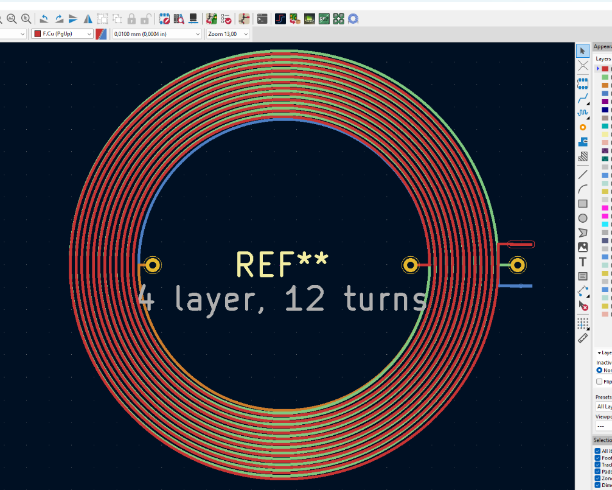

# KiCad Coil Generator UI

This tool creates PCB coils that can be either directly inserted into the PCB itself, or exported as a footprint. The UI can be accessed from within the PCB editor:

_(The button for the UI is located within the addon section)_

This UI contains all relevant PCB coil settings to generate any desired coil.

## Generate Coil

By pressing the `Generate Coil` button, a new coil footprint is generated and inserted into the board. It can be moved freely but it has no schematic symbol attached to it. This makes it a bit tricky with netlists.

_(Generated coil inside the PCB editor)_

## Save as Project Footprint

Once a fitting coil has been generated, that coil can be stored on disk as a footprint. The coil generator creates a new footprint library in the project's folder named `PCB Coils` (`pcb_coils` on disk) that is automatically set as project library in the current project.

_(Footprint automatically exported can be viewed in the footprint editor)_

**Note:** KiCad sometimes does not detect the addition of a new library to the project. A restart of the program fixes that issue.

## Future Goals

- [ ] Add support for stretched coils
- [ ] Add support for rectangular coils
- [ ] Display coil statistics in the UI, [similar to TI's implementation](https://webench.ti.com/wb5/LDC)